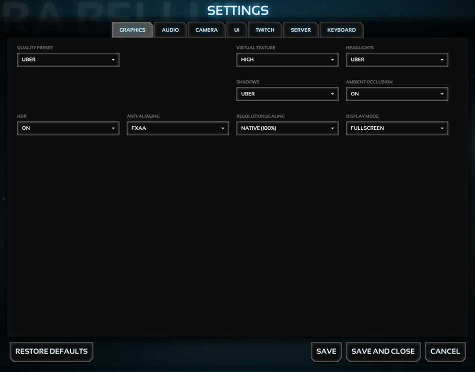

Example 1 - using grid functions
=====================

## READ THIS ##
Please read the **settingsManager** [documentation](../../) before you will start.

## Summary - Setup ##
Change grid attributes from an item-object

## Summary - Example image ##
_example1.png_

*******************************************************************************
## Setup ##

This will change the columns (width) and rows (height) space from the selected item.

```javascript
settingsManager.tab.get("graphics").item.get("quality").columns(2).rows(2);
```

*******************************************************************************
## Example image ##

