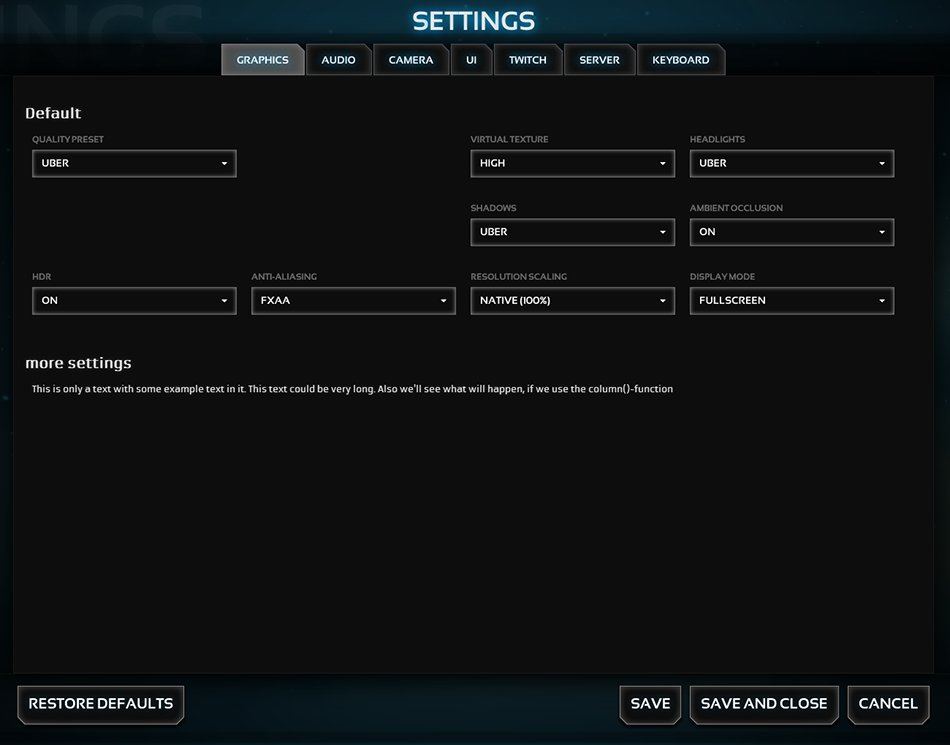

Example 2 - using group functions
=====================

## READ THIS ##
Please read the **settingsManager** [documentation](../../) before you will start.

## Summary - Setup ##
Add a group to the "GRAPHICS" tab and create a new "text"-item.

## Summary - Example image ##
_example2.png_

*******************************************************************************
## Setup ##

This will create a new group, named "more settings" in the "graphics" tab.

**Note:** A "Default" group will appear on top of the new group. The **default** group automatically appears, if its existing and is not the only group in this (sub)tab.

```javascript
settingsManager.tab.get("graphics").group.add("more settings");
```

This will add a new 'text'-item to the previous created group and expand to a three-column-grid.

```javascript
settingsManager.tab.get("graphics").group.get("more_settings").item.add("u","text",{text: "This is only a text with some example text in it. This text could be very long. Also we'll see what will happen, if we use the column()-function", columns: 3});
```


*******************************************************************************
## Example image ##

