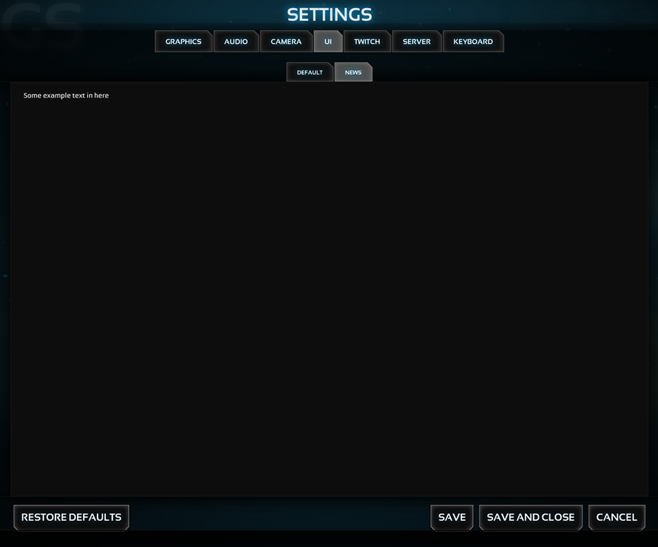

Example 3 - using subTab functions
=====================

## READ THIS ##
Please read the **settingsManager** [documentation](../../) before you will start.

## Summary - Setup ##
Add a new subtab to the "UI" tab and create a new "text"-item.

## Summary - Example image ##
_example3.png_

*******************************************************************************
## Setup ##

This will create a new subTab named "NEWS" in the "ui" tab.

**Note:** A "Default" subTab will appear before the new subtab. The **default** subtab automatically appears, if it's existing and is not the only subTab in this tab.

```javascript
settingsManager.tab.get("ui").sub.add("News");
```

This will add a new 'text'-item to the previous created subTab.

```javascript
settingsManager.tab.get("ui").sub.get("news").item.add("ux","text",{text: "Some example text in here"});
```

*******************************************************************************
## Alternatives ##

Here is a one line example:

```javascript
settingsManager.tab.get("ui").sub.add("News").item.add("ux","text",{text: "Some example text in here"});
```

Here is another example:

```javascript
var newSubTab = settingsManager.tab.get("ui").sub.add("News");
newSubTab.item.add("ux","text",{text: "Some example text in here"});
```


*******************************************************************************
## Example image ##

