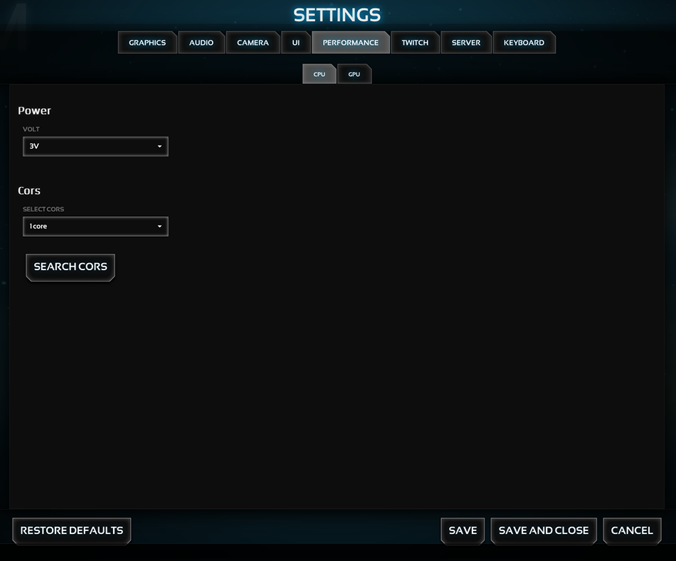

Example 4 - using all containers
=====================

## READ THIS ##
Please read the **settingsManager** [documentation](../../) before you will start.

## Summary - Setup ##
Add a new tab "performance" with two subTabs "CPU" and "GPU" and create two groups with items in the "CPU" subTab

## Summary - Example image ##
_example4.png_

*******************************************************************************
## Setup ##

This will create a new tab named "PERFORMANCE".

```javascript
var pTab = settingsManager.tab.add("performance");
```

This will add two subTabs named "CPU" and "GPU"

```javascript
pTab.sub.add("CPU");
pTab.sub.add("GPU");
```

This will create a "Power" group with a "select" item.
```javascript
pTab.sub.get("cpu").group.add("Power").item.add("c2","select",{title: "Volt", options: {3: "3V",6: "6V",100:"100V"},default: 3});
```

This will create a "Cors" group with a "select" item and a 'button' item
```javascript
pTab.sub.get("cpu").group.add("Cors").item.add("c","select",{title: "Select Cors", options: {1: "1 core",2: "2 cores",3: "3 cores",4: "4 cores"},columns: 4});
pTab.sub.get("cpu").group.get("cors").item.add("c1","button",{title: "Search Cors", onClick: function(){console.log("CLICKED!")}});
```

**Note:** The 'onClick' attribute must be a callback function. In this example it's a simple log in the console.

**ALSO note:** The 'performance'-tab is still inactive and must now be assigned to the DOM:

```javascript
settingsManager.tab.assign("performance");
```

*******************************************************************************
## Example image ##

